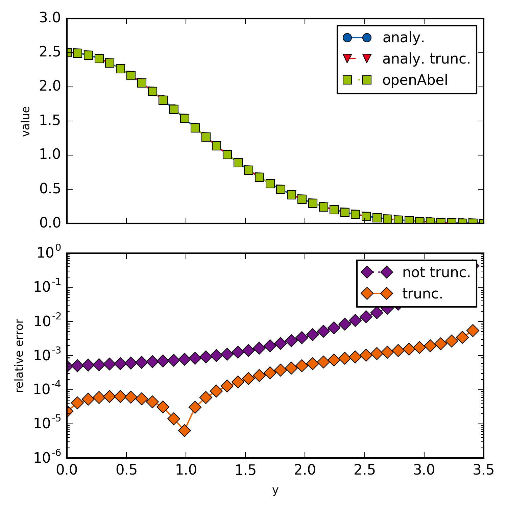

example000_simpleForward
=================

This example is just a simple forward transform of a Gaussian. Aside from showing how to do a simple forward transform, this example shows how for non truncated domain an error is introduced.
   
   

   Simple forward transform of a Gaussian.

.. literalinclude:: ../../examples/example000_simpleForward.py
    :linenos:
    :language: python
