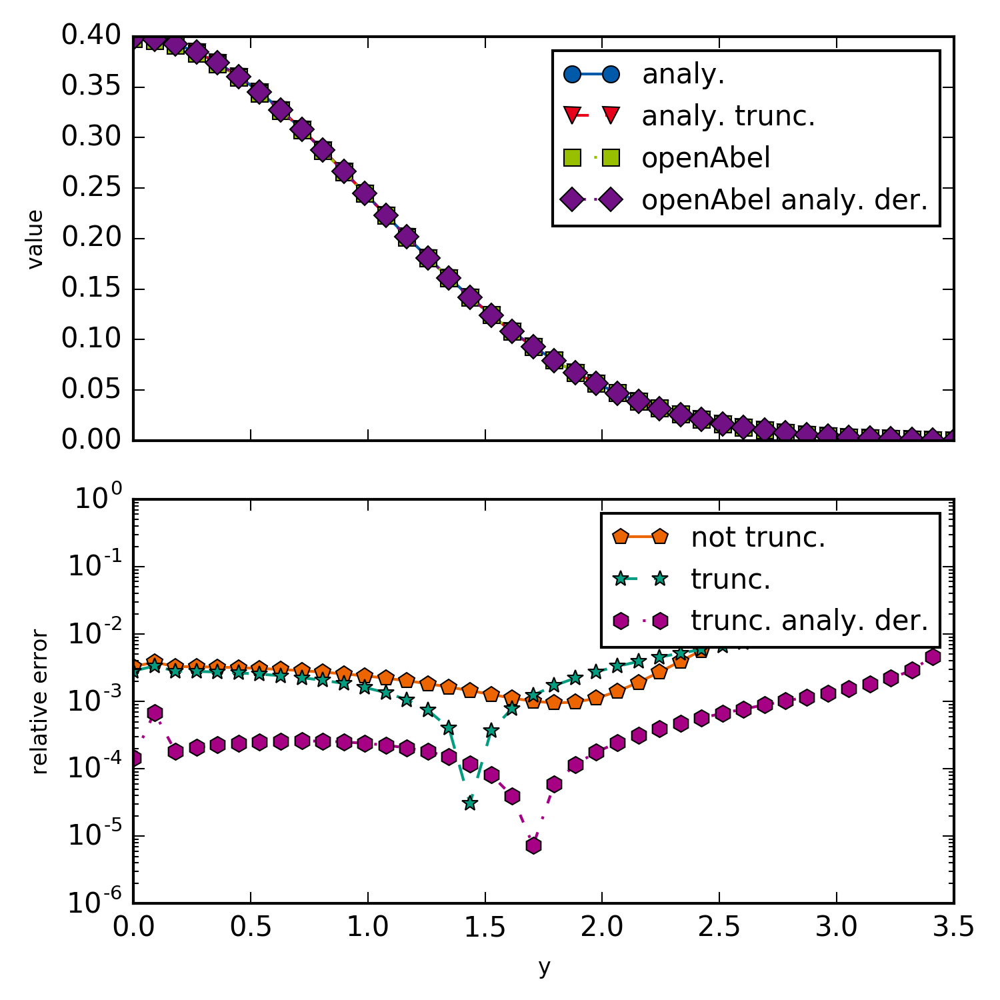

example001_simpleBackward
=================

This example is just a simple backward transform of a Gaussian. Aside from showing how to do a simple backward transform, this example shows how for non truncated domain an error is introduced, and how taking the derivative analytically of the data (if possible) improves the error. Taking numerical derivatives always amplifies noise and increases the resulting error.
   
   

   Simple backward transform of a Gaussian.

.. literalinclude:: ../../examples/example001_simpleBackward.py
    :linenos:
    :language: python
