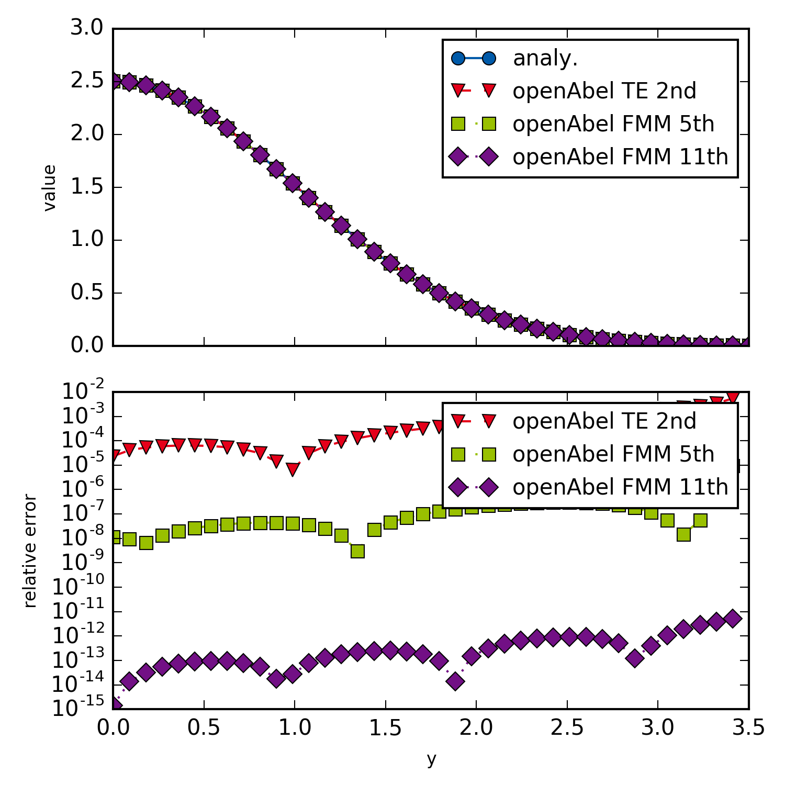

# example002_method_order

This example shows how to switch to other transform methods and orders. It illustrates how quickly the errors of high
order methods converge to machine precision, even for very small data sets. It is of course important that the input
data is sufficiently smooth and other errors (e.g. truncation errors) are small enough as well.



```{ .python }
--8<-- "examples/example002_method_order.py"
```
