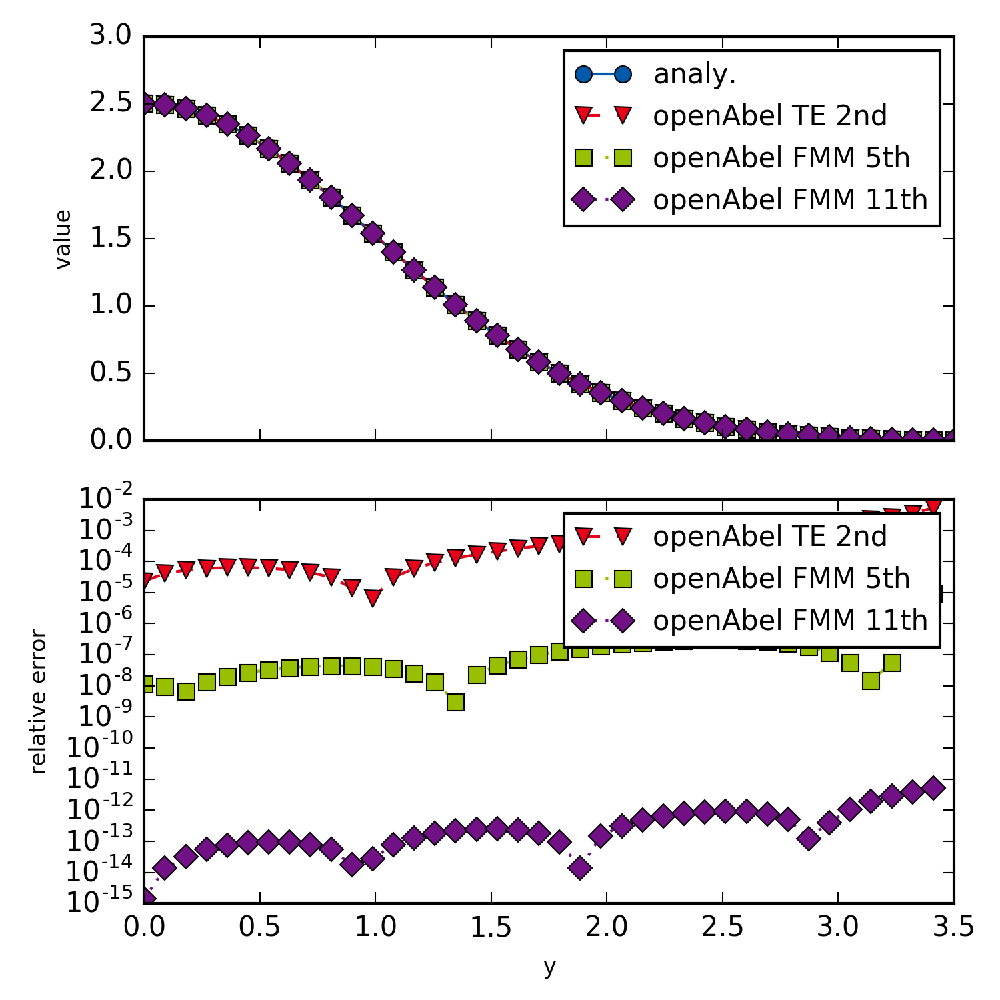

example002_methodOrder
=================

This example shows how to switch to other transform methods and orders
   
   

   Different methods and orders.

.. literalinclude:: ../../examples/example002_methodOrder.py
    :linenos:
    :language: python
