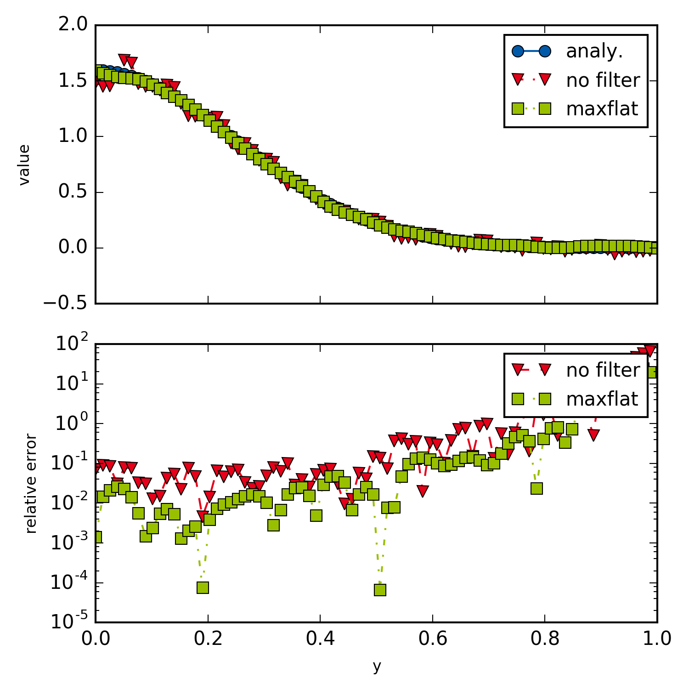

# example003_noisy_backward

This example shows how to filter and transform noisy data. It illustrates how noisy input data can lead to large
errors of the backward transform result, and how filters can be used to -- at least visually -- alleviate those
errors.



Maximally flat filters have been calculated as described in a paper by
[Hosseini](https://ieeexplore.ieee.org/document/7944698/), and a small
[Mathematica script](https://github.com/oliverhaas/openAbel/blob/main/add/calcMaxFlat.nb) of the calculation is
provided in the additional materials.

```{ .python }
--8<-- "examples/example003_noisy_backward.py"
```
