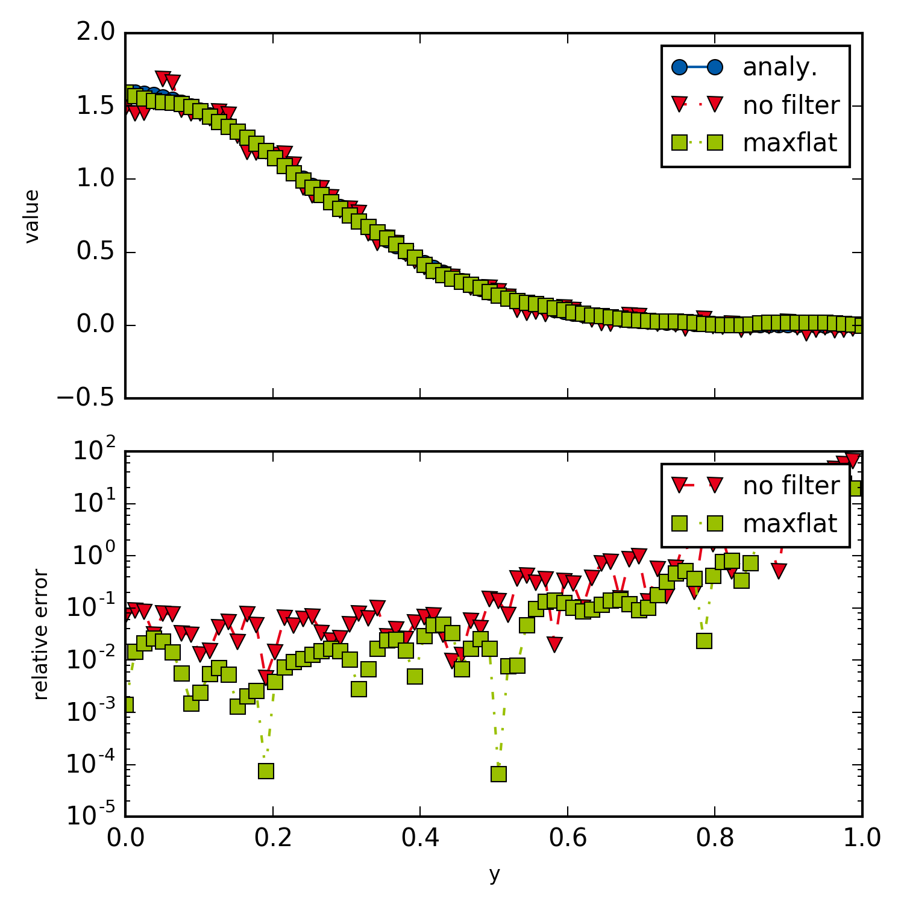

example003_noisyBackward
=================

This example shows how to filter and transform noisy data. It illustrates how noisy input data can lead to large errors of the the backward transform result, and how filters can be used to -- at elast visually -- alleviate those errors.
   
   

   Backward transform of noisy data.
   
Maximally flat filters have been calculated as described in a paper by `Hosseini <https://ieeexplore.ieee.org/document/7944698/>`_, 
and a small `Mathematica script <https://github.com/oliverhaas/openAbel/blob/master/add/calcMaxFlat.nb>`_ of the calculation 
is provided in the additional materials.

.. literalinclude:: ../../examples/example003_noisyBackward.py
    :linenos:
    :language: python
