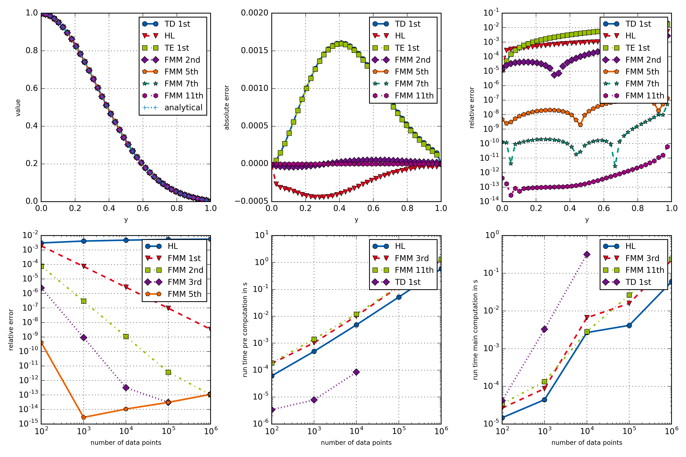

# example004_full_comparison

This example provides a rather extensive comparison of different **openAbel** methods. It shows how well the main
methods perform in every regard, especially if the input data is sufficiently smooth. Most importantly one can see
the fast convergence of the higher order methods in the bottom left plot, and the linear computational complexity of
the main methods in the bottom middle and right plots.



```{ .python }
--8<-- "examples/example004_full_comparison.py"
```
