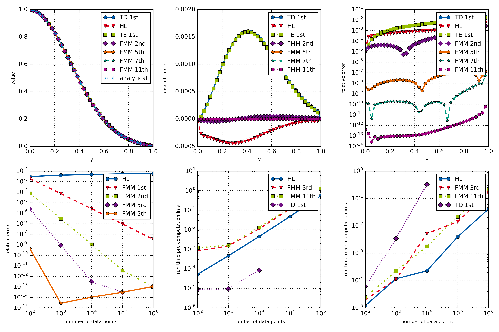

example004_fullComparison
=================

This example provides a rather extensive comparison of different **openAbel** methods. The output figure is given here:
   
   

   Comparison of different openAbel methods.

Most importantly one can see the fast convergence of the higher order methods in the bottom left plot, and the linear
computational complexity of the main methods in the bottom middle and right plots.

.. literalinclude:: ../../examples/example004_fullComparison.py
    :linenos:
    :language: python
    
