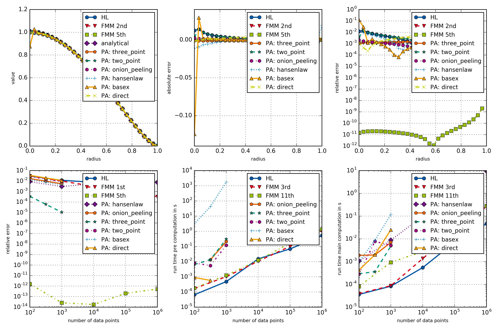

# example005_comparison_pyabel

This example provides a rather extensive comparison of different **openAbel** methods with
[PyAbel](https://github.com/PyAbel/PyAbel) methods. It shows how well the main methods of **openAbel** perform in
every regard, especially if the input data is sufficiently smooth.

Since **PyAbel**'s focus is on the backward (or inverse) transform, this example does it as well.



```{ .python }
--8<-- "examples/example005_comparison_pyabel.py"
```
