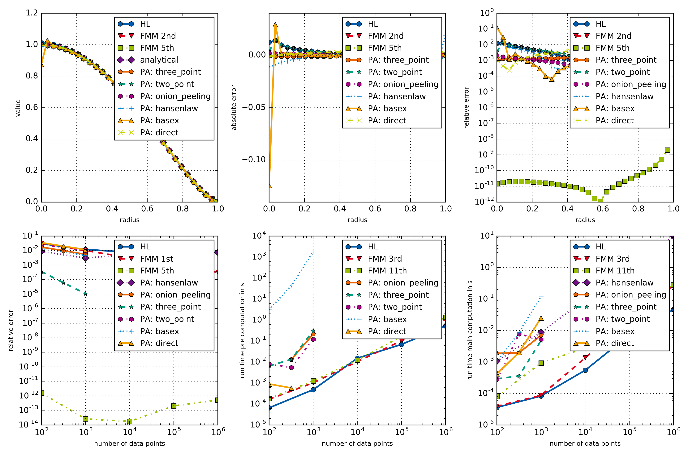

example005_comparisonPyAbel
=================

This example provides a rather extensive comparison of different **openAbel** methods with
`PyAbel <https://www.github.com/PyAbel/PyAbel>`_ methods. The output figure is given below.
   
   

   Comparison of different openAbel with PyAbel methods.

Since **PyAbel**'s focus is on the backward (or inverse) transform, this example does it as well.

.. literalinclude:: ../../examples/example005_comparisonPyAbel.py
    :linenos:
    :language: python

