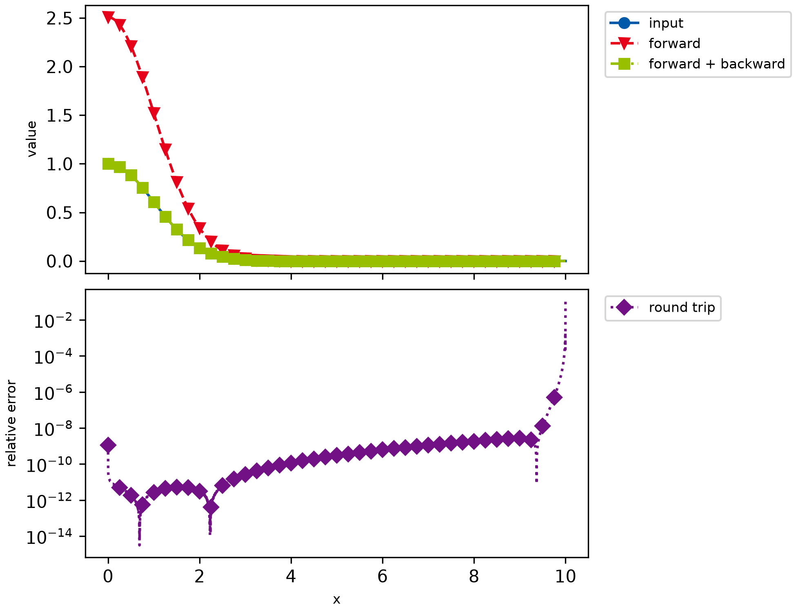

# example006_simple_forward_and_backward

This example applies the forward transform to a Gaussian and then the backward transform to the result, and compares
the round trip with the input. The backward transform differentiates its input numerically, which amplifies the small
error of the forward transform; the round trip is still accurate to about 1e-8 over most of the domain. Towards the
end of the domain, where the Gaussian is vanishingly small, the truncation of the integration domain shows in the
relative error.



```{ .python }
--8<-- "examples/example006_simple_forward_and_backward.py"
```
